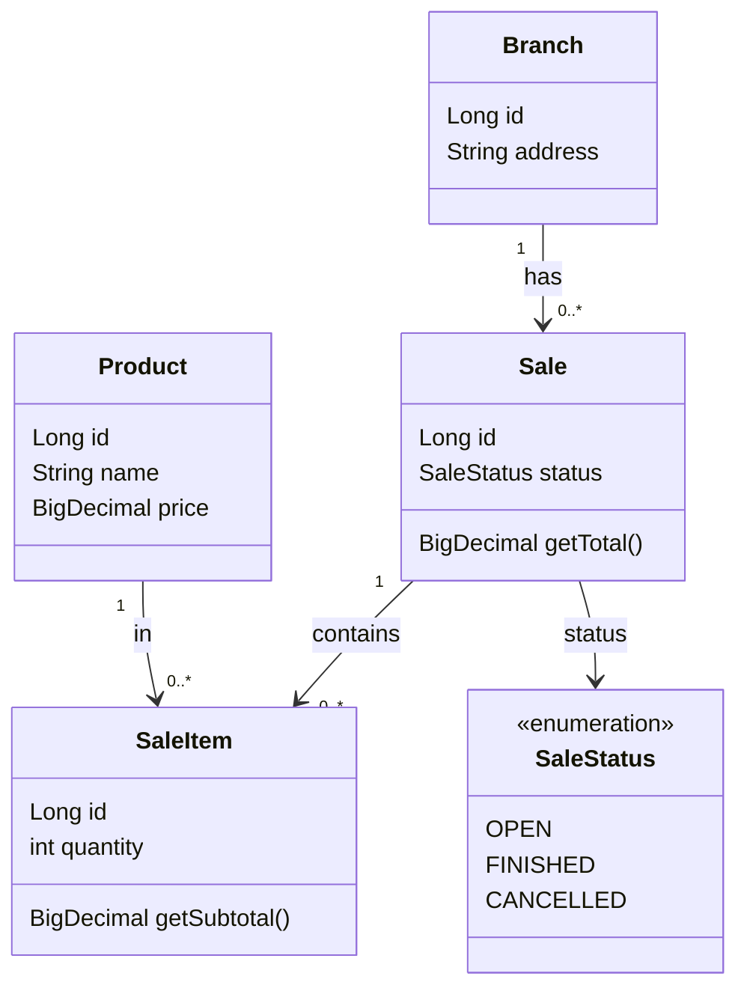
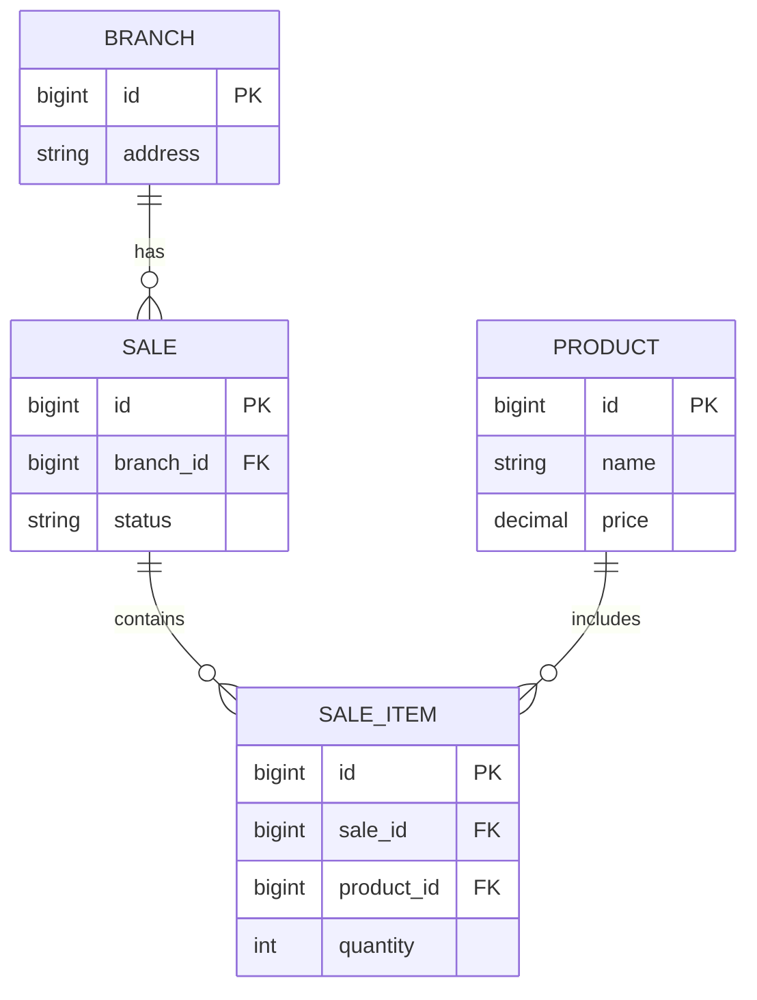

# 🛒 Supermarket API

API REST desarrollada con **Spring Boot** que modela un sistema de ventas para un supermercado, enfocada en buenas prácticas de backend, diseño de dominio y preparación para entornos productivos.

Este proyecto fue construido como parte de un recorrido práctico de aprendizaje backend, priorizando **claridad arquitectónica**, **evolución incremental** y **calidad profesional**.

Link de documentación con Swagger:
https://supermarket-api-jpdjcp.fly.dev/swagger-ui/index.html

---

## 🎯 Propósito del proyecto

- Diseñar una API REST realista y mantenible
- Aplicar principios de diseño de dominio (DDD liviano)
- Implementar un **ciclo de vida explícito de ventas**
- Preparar el proyecto para **deploy productivo**
- Incorporar **CI/CD automatizado**
- Documentar la API de forma clara con **Swagger / OpenAPI**

---

## 🧱 Stack tecnológico

- **Java 17**
- **Spring Boot**
- **Spring Web (REST)**
- **Spring Data JPA**
- **Hibernate**
- **Flyway** (planeado para versionado de base de datos)
- **H2 / PostgreSQL** (según entorno)
- **Maven**
- **Swagger / OpenAPI**
- **JUnit 5 + Mockito**
- **GitHub Actions (CI/CD)**
- **Fly.io** (deploy)

---

## 🧩 Modelo de dominio (visión general)

Entidades principales:

- **Branch**
- **Product**
- **Sale**
- **SaleItem**

### Ciclo de vida de una venta (`Sale`)

Una venta tiene un estado explícito:

- `OPEN` → venta en curso
- `FINISHED` → venta finalizada correctamente
- `CANCELLED` → venta cancelada

Las transiciones de estado se realizan mediante endpoints específicos, evitando estados inválidos y acciones ambiguas.

---

## 🧠 Diagrama de clases (UML)

---

## 🗄️ Diagrama Entidad–Relación (ERD)

---

## 🌍 Estrategia de entornos

El proyecto utiliza **Spring Profiles** para separar configuración:

- `dev` → entorno local
- `prod` → entorno productivo (Fly.io)
- `test` → CI/CD Maven - GitHub Actions

Características:
- Sin valores sensibles hardcodeados
- Configuración vía variables de entorno
- Health check habilitado mediante **Spring Actuator**

---

## 🚀 CI / CD

El proyecto cuenta con **CI/CD automatizado usando GitHub Actions**:

Pipeline actual:
1. Build del proyecto
2. Ejecución de tests
3. Deploy automático a Fly.io (si todo pasa correctamente)

Esto garantiza que `main` esté siempre en estado deployable.

---

## 📖 Documentación de la API

La API está documentada con **Swagger / OpenAPI**, incluyendo:

- Endpoints disponibles
- Modelos
- Estados posibles
- Transiciones del ciclo de vida de una venta
- Ejemplos de uso

👉 **Swagger UI**  
Disponible en el entorno productivo (Fly.io)
