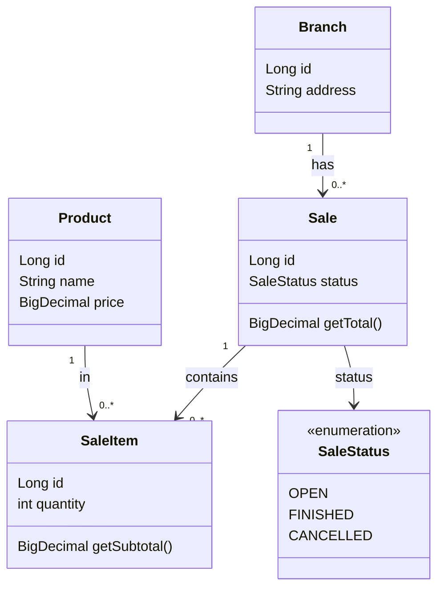
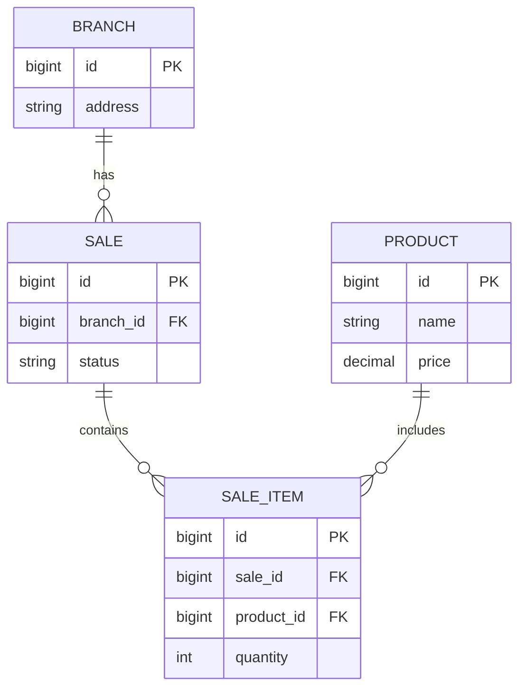

# 🛒 Supermarket API

API REST desarrollada con **Spring Boot** para gestionar ventas, productos y usuarios, implementando un ciclo de vida de ventas explícito y buenas prácticas de diseño backend.

Este proyecto está orientado a demostrar:
- diseño de dominio claro
- arquitectura mantenible
- testing automatizado
- despliegue en entorno productivo

👉 [Ver documentación (Swagger UI)](https://supermarket-api-jpdjcp.fly.dev/swagger-ui/index.html)

---

## 🚀 Funcionalidades principales

- Autenticación basada en **JWT**
- Gestión de ventas con ciclo de vida (`OPEN → FINISHED / CANCELLED`)
- Administración de productos y sucursales
- Control de acceso por roles (`USER`, `ADMIN`)
- Validación de datos y manejo global de errores
- API REST consistente y predecible

---

## 🧱 Stack tecnológico

- Java 21
- Spring Boot
- Spring Web / Spring Data JPA / Hibernate
- Spring Security (JWT)
- MySQL / H2 (según entorno)
- Flyway (migraciones)
- Testcontainers (tests de integración)
- JUnit 5 + Mockito
- Docker / Docker Compose
- GitHub Actions (CI/CD)
- Fly.io (deploy)
- Swagger / OpenAPI

---

## 🏗️ Arquitectura

El proyecto sigue una arquitectura en capas:

- **Controller** → exposición de endpoints REST  
- **Service** → lógica de negocio y reglas de dominio  
- **Repository** → acceso a datos  

Principales decisiones:
- separación clara de responsabilidades  
- validación del estado de negocio (ej: ventas solo modificables en estado `OPEN`)  
- manejo centralizado de excepciones  
- uso de transacciones a nivel de servicio  

---

## 🔐 Seguridad

- Autenticación mediante **JWT**
- Sistema **stateless**
- Autorización basada en roles (`USER`, `ADMIN`)
- Protección de endpoints sensibles

---

## 🧩 Modelo de dominio

Entidades principales:

- `User`
- `Sale`
- `SaleItem`
- `Product`
- `Branch`

### Ciclo de vida de una venta

- `OPEN` → editable  
- `FINISHED` → cerrada correctamente  
- `CANCELLED` → anulada  

Las transiciones se realizan mediante endpoints específicos, evitando estados inválidos.

---

## 📊 Diagrama UML


```mermaid
classDiagram
class Product {
  Long id
  String name
  BigDecimal price
}

class Branch {
  Long id
  String address
}

class Sale {
  Long id
  SaleStatus status
  BigDecimal getTotal()
}

class SaleItem {
  Long id
  int quantity
  BigDecimal getSubtotal()
}

class SaleStatus {
  <<enumeration>>
  OPEN
  FINISHED
  CANCELLED
}

Branch "1" --> "0..*" Sale : has
Sale "1" --> "0..*" SaleItem : contains
Product "1" --> "0..*" SaleItem : in
Sale --> SaleStatus : status
```

---

## 🗄️ Diagrama ERD


```mermaid
erDiagram
  BRANCH {
    bigint id PK
    string address
  }

  SALE {
    bigint id PK
    bigint branch_id FK
    string status
  }

  PRODUCT {
    bigint id PK
    string name
    decimal price
  }

  SALE_ITEM {
    bigint id PK
    bigint sale_id FK
    bigint product_id FK
    int quantity
  }

  BRANCH ||--o{ SALE : has
  SALE ||--o{ SALE_ITEM : contains
  PRODUCT ||--o{ SALE_ITEM : includes
```

---

## 🧪 Testing

- Tests unitarios para lógica de negocio (JUnit + Mockito)
- Tests de integración con **Testcontainers (MySQL real)**
- Ejecución automática en pipeline CI

---

## 🌍 Configuración de entornos

Uso de **Spring Profiles**:

- `dev` → entorno local  
- `test` → ejecución de tests  
- `integration` → tests con Testcontainers  
- `prod` → entorno productivo (Fly.io)  

Características:
- configuración mediante variables de entorno  
- sin credenciales hardcodeadas  
- health check con Spring Actuator  

---

## 🚀 CI/CD

Pipeline automatizado con **GitHub Actions**:

1. Build del proyecto  
2. Ejecución de tests  
3. Deploy automático a producción  

Esto asegura que la rama `main` esté siempre en estado desplegable.

---

## ▶️ Cómo ejecutar el proyecto

```bash
mvn clean install
docker compose up
mvn spring-boot:run
```

---

## 📌 Documentación de la API

La API está documentada con **Swagger / OpenAPI**, incluyendo:

- endpoints disponibles  
- modelos de datos  
- estados y transiciones  
- ejemplos de uso  

👉 [Acceder a Swagger UI](https://supermarket-api-jpdjcp.fly.dev/swagger-ui/index.html)
